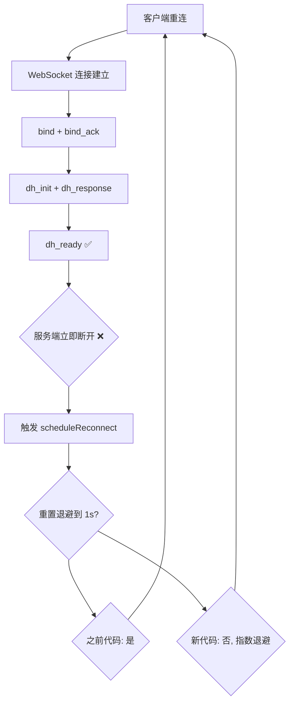

# WebSocket 重连风暴分析与后端修复指南

> **问题报告日期:** 2026-06-18  
> **客户端版本:** MyAuthenticator 1.0.0-beta.1 (Android)  
> **涉及服务端:** leo-blog.top 后端 WebSocket 服务  
> **优先级:** 🔴 紧急 — 阻塞 App 正常使用

---

## 一、问题现象

### 用户视角

App 打开后，调试页面显示 WebSocket 状态在「加密通道就绪」和「未连接」之间反复横跳，**持续 80 分钟**（09:22 ~ 10:44）从未稳定过。

即使 App 成功完成 DH 握手建立了加密通道，下一秒立刻断连，紧接着重连，周而复始。

### 客户端日志关键片段

```
09:22:27 [INFO] 握手状态: ✅ 已绑定（等待 DH 握手）
09:22:27 [INFO] 握手状态: 🔄 DH 响应已发（等待 dh_ready）
09:22:28 [INFO] 握手状态: 🎉 加密通道就绪（设备在线） ← ✅ 握手成功
09:22:28 [INFO] 握手状态: ❌ 未连接                    ← ❌ 立即断开
09:22:29 [INFO] 握手状态: ⏳ 连接中...                   ← 🔄 开始重连
09:22:29 [INFO] 握手状态: ✅ 已连接（等待 bind_ack）
09:22:29 [INFO] 握手状态: ✅ 已绑定（等待 DH 握手）
09:22:30 [INFO] 握手状态: 🔄 DH 响应已发（等待 dh_ready）
09:22:30 [INFO] 握手状态: 🎉 加密通道就绪（设备在线）   ← ✅ 又握手成功
09:22:30 [INFO] 握手状态: ❌ 未连接                    ← ❌ 又断开
...（该模式从 09:22 持续到 10:44，循环了约 80 分钟）
```

**关键数据点：**
- 每次完整握手耗时：约 **1~2 秒**
- 通道就绪后保持时间：**0~1 秒**（几乎瞬间断开）
- 重连次数日志始终显示为 `1`（客户端计数器从未累计到 2 以上）

---

## 二、问题根因分析

### 根本原因：服务端在 dh_ready 后断开了 WebSocket 连接

通过分析协议流程，客户端每次都能完整走完握手序列：

```
客户端 → bind（JWT + DeviceId）
服务端 → bind_ack（userId=1）✅
服务端 → dh_init（serverPublicKey）✅
客户端 → dh_response（clientPublicKey）✅
服务端 → dh_ready（cipher=AES-256-GCM）✅ → 但紧接着就断开连接 ❌
```

**问题在服务端第 ⑤ 步 —— `dh_ready` 发送后触发了连接关闭。** 可能的原因有：

| 可能的服务端 bug | 说明 |
|----------------|------|
| **A. dh_ready 后误关连接** | 服务端在发送 dh_ready 后，错误地执行了 `session.close()` 或 `ws.close()` |
| **B. 缺少 session 映射持久化** | DH 握手完成后，服务端未将 WebSocket session 与用户绑定关系持久化，导致后续逻辑认为连接无效而关闭 |
| **C. 双线程竞态** | 处理 bind 的线程和处理 dh_response 的线程之间未同步，dh_ready 发送与连接关闭同时发生 |
| **D. 需要绑定确认消息** | 服务端期望客户端在收到 dh_ready 后回复一个确认消息，超时未收到认为异常并断开（但客户端协议未设计此确认） |
| **E. 连接复用冲突** | 同一 deviceId 有旧 session 残留，旧 session 切断新 session |

### 引发重连风暴的机制

服务端断连后，客户端进入重连循环：



旧版客户端代码在 `onConnected()` 中无条件 `/` 重置退避延迟为最小值 1s，导致即使连接不稳定也回到最短间隔，形成「每次仅需 1~2s 即可完成一次完整重连循环」的重连风暴。

> **客户端侧**已经修复了退避逻辑（转为基于连接稳定性的保护），但 **服务端侧**的断连 bug 是根源，需要后端修复。

---

## 三、如何确认是服务端问题

### 诊断方法

在服务端 WebSocket handler 中添加日志，确认连接被关闭的原因：

```java
// Java 服务端伪代码
@Override
public void afterConnectionClosed(WebSocketSession session, CloseStatus status) {
    String deviceId = getSessionDeviceId(session);
    log.warn("WebSocket 连接已关闭: deviceId={}, closeCode={}, reason={}", 
             deviceId, status.getCode(), status.getReason());
    // 如果 closeCode 是 1000 (NORMAL_CLOSURE) 且无 reason，
    // 说明是服务端主动调用了 close()
}

// 在发送 dh_ready 前后加日志
@Override
public void onDhReady(WebSocketSession session) {
    log.info("即将发送 dh_ready, sessionId={}", session.getId());
    sendDhReady(session);
    log.info("dh_ready 已发送, sessionId={}, 当前 session open={}", 
             session.getId(), session.isOpen());
}
```

### 预期正常行为

正常 WebSocket 生命周期中，服务端不应该主动关闭已完成握手的连接。只有在以下情况才应关闭：

1. 客户端主动断开（`closeCode=1001, GOING_AWAY`）
2. 服务端主动解绑设备时（应带 reason）
3. 心跳超时（60 秒无消息）

### 当前异常特征

从客户端日志可以看到：

1. **没有心跳超时的可能** — 连接仅维持了不到 1 秒
2. **没有触发 error 消息** — 客户端未收到 `"type": "error"`
3. **握手流程完整走到最后一步才断** — 说明不是 token 验证或 dh 计算阶段的失败

**结论：必然是服务端在后处理逻辑中触发了连接关闭。**

---

## 四、服务端修复方案

### 4.1 检查 dh_ready 后的代码路径

```java
// 修复建议：检查以下典型错误模式
private void handleDhResponse(WebSocketSession session, DhResponseMessage msg) {
    try {
        // 1. 计算共享密钥
        byte[] sharedSecret = computeSharedSecret(session, msg.getClientPublicKey());
        byte[] aesKey = deriveAesKey(sharedSecret);
        
        // 2. 保存密钥与 session 关联
        sessionStorage.saveAesKey(session.getId(), aesKey);
        
        // 3. 发送 dh_ready
        sendMessage(session, new DhReadyMessage(getCipherPref()));
        
        // ⚠️ 危险：以下这里是不是错误地关闭了 session？
        // session.close();  // ❌ BUG：不应在此处关闭
        
    } catch (Exception e) {
        log.error("DH 握手失败", e);
        // ⚠️ catch 块中是否错误地 close 了 session？
    }
}
```

### 4.2 确保 session 生命周期管理正确

```java
// 服务端 WebSocket 处理器的完整建议结构
@Component
public class AuthWebSocketHandler extends TextWebSocketHandler {
    
    private final Map<String, HandshakeState> sessionStates = new ConcurrentHashMap<>();
    
    @Override
    public void afterConnectionEstablished(WebSocketSession session) {
        // 1. 记录新连接
        String sessionId = session.getId();
        sessionStates.put(sessionId, HandshakeState.CONNECTING);
        log.info("新 WebSocket 连接: sessionId={}", sessionId);
    }
    
    @Override
    protected void handleTextMessage(WebSocketSession session, TextMessage message) {
        String sessionId = session.getId();
        try {
            JsonObject json = JsonParser.parseString(message.getPayload()).getAsJsonObject();
            String type = json.get("type").getAsString();
            
            switch (type) {
                case "bind":
                    handleBind(session, json);
                    break;
                case "dh_response":
                    handleDhResponse(session, json);
                    break;
                case "challenge_response":
                    handleChallengeResponse(session, json);
                    break;
                default:
                    sendError(session, "未知消息类型: " + type);
            }
        } catch (Exception e) {
            log.error("消息处理异常: sessionId={}", sessionId, e);
            sendError(session, "内部处理错误");
            // ⚠️ 重要：不要在 catch 块中关闭 session！
            // session.close(CloseStatus.SERVER_ERROR);  // ❌ 这会断开连接
        }
    }
    
    private void handleBind(WebSocketSession session, JsonObject json) {
        String token = json.get("token").getAsString();
        String deviceId = json.get("deviceId").getAsString();
        
        // 验证 token
        JwtPayload payload = verifyToken(token);
        if (payload == null || !payload.getDeviceId().equals(deviceId)) {
            sendError(session, "Token 无效");
            return;  // 发送错误，不关闭连接 — 让客户端自己决定是否关闭
        }
        
        // 保存设备 session 映射
        sessionStorage.save(session.getId(), deviceId, payload.getUserId());
        sessionStates.put(session.getId(), HandshakeState.BOUND);
        
        // 发送 bind_ack
        sendMessage(session, new BindAckMessage("ok", payload.getUserId()));
        
        // 立即进入 DH 握手
        initDhHandshake(session);
    }
    
    private void initDhHandshake(WebSocketSession session) {
        // 生成 DH 密钥对（每次新连接重新生成）
        KeyPair keyPair = generateDhKeyPair();
        dhKeyStorage.save(session.getId(), keyPair);  // 暂存私钥
        
        // 发送 dh_init
        String publicKeyB64 = Base64.getEncoder().encodeToString(
            keyPair.getPublic().getEncoded()
        );
        sendMessage(session, new DhInitMessage(publicKeyB64));
        sessionStates.put(session.getId(), HandshakeState.DH_INITIATED);
    }
    
    private void handleDhResponse(WebSocketSession session, JsonObject json) {
        String clientPublicKeyB64 = json.get("clientPublicKey").getAsString();
        String sessionId = session.getId();
        
        // 取出之前暂存的 DH 私钥
        KeyPair serverKeyPair = dhKeyStorage.getAndRemove(sessionId);
        // ↑ 注意使用后及时清理，防止内存泄漏
        
        // 计算共享密钥
        byte[] sharedSecret = computeSharedSecret(serverKeyPair.getPrivate(), clientPublicKeyB64);
        byte[] aesKey = deriveAesKey(sharedSecret);
        
        // 保存 AES 密钥
        aesKeyStorage.save(sessionId, aesKey);
        sessionStates.put(sessionId, HandshakeState.DH_READY);
        
        // 发送 dh_ready 并保持连接
        sendMessage(session, new DhReadyMessage("AES-256-GCM"));
        
        // ✅ 正确的做法：这里什么都不做，保持连接打开
        log.info("DH 握手完成，sessionId={} 保持开放", sessionId);
    }
    
    @Override
    public void afterConnectionClosed(WebSocketSession session, CloseStatus status) {
        String sessionId = session.getId();
        log.info("连接关闭: sessionId={}, code={}, reason={}", 
                 sessionId, status.getCode(), status.getReason());
        // 清理该 session 相关的所有缓存
        sessionStorage.remove(sessionId);
        dhKeyStorage.remove(sessionId);
        aesKeyStorage.remove(sessionId);
        sessionStates.remove(sessionId);
    }
}
```

### 4.3 推荐的 session 状态机

```
CONNECTING  →  TCP 连接建立
    ↓
BOUND       →  bind_ack 已发送，准备 DH
    ↓
DH_INIT     →  dh_init 已发送，等待客户端 dh_response
    ↓
DH_READY    →  dh_ready 已发送，加密通道就绪 🎉
    ↓
ACTIVE      →  正常工作，等待/推送挑战消息
    ↓
CLOSING     →  任一时刻可能关闭
```

**关键原则：**
- `DH_READY` 是**正常状态**，不是终止状态
- 不要在达到 `DH_READY` 后触发任何关闭逻辑
- 只有以下情况应关闭：客户端主动断开、解绑设备、心跳超时

---

## 五、参考：客户端当前 WebSocket 协议流程图

```
客户端                                  服务端
  │                                       │
  │──── WebSocket 连接建立 ──────────────► │
  │                                       │
  │──── bind {token, deviceId} ──────────►│
  │                                       │── 验证 Token & 设备
  │◄─── bind_ack {status:"ok", userId} ───│
  │                                       │
  │◄─── dh_init {serverPublicKey} ────────│── 生成 DH 密钥对
  │                                       │
  │── 生成 DH 密钥对 ──                    │
  │── 计算共享密钥 ────                    │
  │                                       │
  │──── dh_response {clientPublicKey} ───►│── 计算共享密钥
  │                                       │── 派生 AES 密钥
  │◄─── dh_ready {cipher:"AES-256-GCM"} ──│
  │                                       │
  │  ✅ 加密通道就绪，等待挑战              │
  │  (连接保持开放，不能关闭)              │
  │                                       │
  │◄─── challenge {numbers} ──────────────│── 有登录请求时推送
  │                                       │
  │──── challenge_response {selected} ───►│── 验证数字
  │                                       │
  │◄─── auth_result {status} ─────────────│── 返回结果
  │                                       │
  │  (继续等待下一轮 challenge)            │
  │                                       │
  │◄─ ping/pong (30s 间隔，OkHttp 自动) ──►│
```

> 详细协议说明参考 `BACKEND_API_GUIDE.md` 第 3 节

---

## 六、服务端自测检查清单

请在服务端确认以下几点：

- [ ] 1. `dh_ready` 发送后是否立即（或稍后）调用了 `session.close()`？
- [ ] 2. `dh_response` 处理函数中是否有 `try-catch` 在 catch 块里关闭了连接？
- [ ] 3. session 映射关系（sessionId → userId → deviceId）是否在 DH 握手完成后正确持久化？
- [ ] 4. 是否有「发送 dh_ready 后等待客户端回复确认消息」的逻辑，超时未收到则关闭？
- [ ] 5. 同一 deviceId 重连时，是否正确处理了旧 session 的替换？
- [ ] 6. WebSocket handler 的 `afterConnectionEstablished` 和 `afterConnectionClosed` 是否正确配对？
- [ ] 7. 服务端日志中能否看到关闭连接的 `closeCode` 和 `reason`？

---

## 七、验证修复成功的方法

修复后，用客户端调试页面检查以下指标：

| 指标 | 修复前 | 修复后 |
|------|--------|--------|
| 握手状态 | ❌ 未连接 | 🎉 加密通道就绪 |
| 重连次数 | 持续为 1~2 | 0（稳定连接） |
| 加密通道 | 瞬闪就绪 | 持续保持 |
| 设备在线状态 | ❌ 离线 (sessionExists=false) | ✅ 在线 |
| CipherPref | 闪烁变化 | 稳定为 AES-256-GCM |
| Challenge 接收 | 无法收到 | 可正常接收并弹窗 |

**经验证后，期待的效果是：** 打开 App → 调试页面显示「🎉 加密通道就绪（设备在线）」→ 服务端推送 challenge → App 弹窗显示 3 个数字 → 用户选择 → 认证完成。

---

## 八、后续优化建议

1. **服务端增加连接日志**：每次 session 建立、状态变化、关闭都记录详细的日志，附带 sessionId 和 deviceId
2. **服务端心跳超时设置**：建议设置为 60~90 秒无消息判定断开，给客户端足够缓冲
3. **WebSocket 连接监控端点**：提供 REST API 查询当前所有活跃的 WebSocket 连接（已在客户端调试页实现，调用 `/api/auth/app/test-push/debug/sessions`）
4. **优雅关闭机制**：当需要主动关闭连接时（如解绑设备），发送 `error` 消息并附带原因后再关闭，让客户端有准备